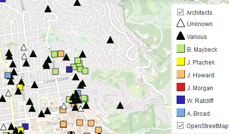

# [Archaeological Research Facility, UC Berkeley](http://arf.berkeley.edu) - Github Page

## Projects
---
### Berkeley Architectural History Mapping in Leaflet (N. Tripcevich, Aug 2020)
<a href="https://arf-berkeley.github.io/berkeleyana/arch/index.html">

View the **[Berkeley Historical Map in the browser](https://arf-berkeley.github.io/berkeleyana/arch/index.html)**
---
This Leaflet map will load in your browser and does not require an app or special libraries. 
Click the Legend icon on the top right to view the legend showing the 6 most well-represented architects in Berkeley 
#### Your current Location requires permission
To make the most of this map on your smartphone give the page permission to indicate your current location. To enable this feature click the black placemark icon on the left.  
A permissions alert will appear. 
On the iPhone it reads: “The website “arf-berkeley.github.io” would like to use your current location". Choose **Allow**.

On Android it reads "Allow arf-berkeley.github.io" to use your location?" Choose **Allow**.

Landmarks Data courtesy of the  [Berkeley Architectural History Association](http://berkeleyheritage.com/berkeley_landmarks/all_landmarks.html), May 2020.

## Sandbox

<a href="https://arf-berkeley.github.io/berkeleyana/README.md">Testing</a>
